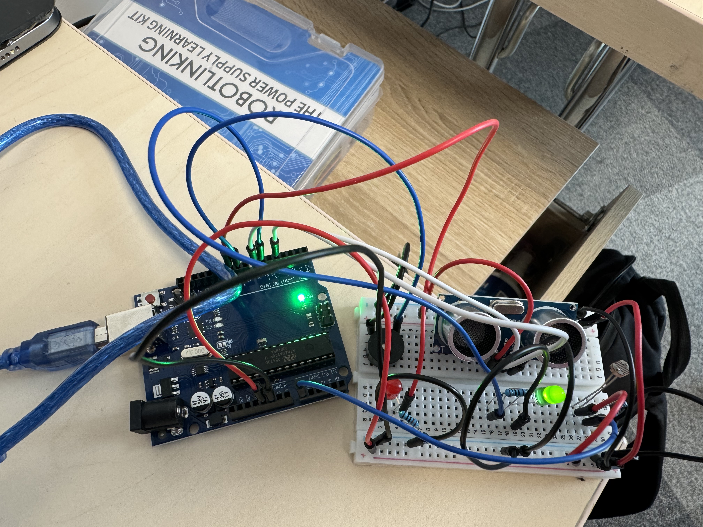
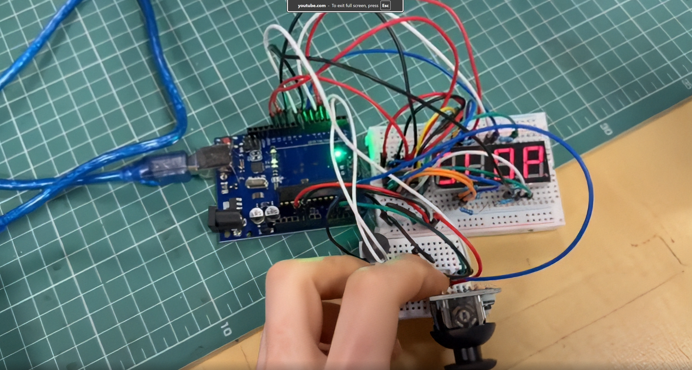

# Github
 Intro to robotics course and projects

\# 3. Home Alarm System — Arduino UNO (Ultrasonic + LDR + LEDs + Buzzer)

\## Demo \& Code

\- 🎥 Video: \

\- 💻 Source code: \[GitHub repo](https://github.com/AGAPIAhttps://github.com/AGAPIA/Introduction-to-robotics/Homework3)

\# 4. Simon Says — Arduino UNO + 74HC595 + Joystick + 4×7-Seg (CC)

\## Demo \& Code

\- 🎥 Video: \

\- 💻 Source code: \[GitHub repo](https://github.com/AGAPIAhttps://github.com/AGAPIA/Introduction-to-robotics/Homework4)
