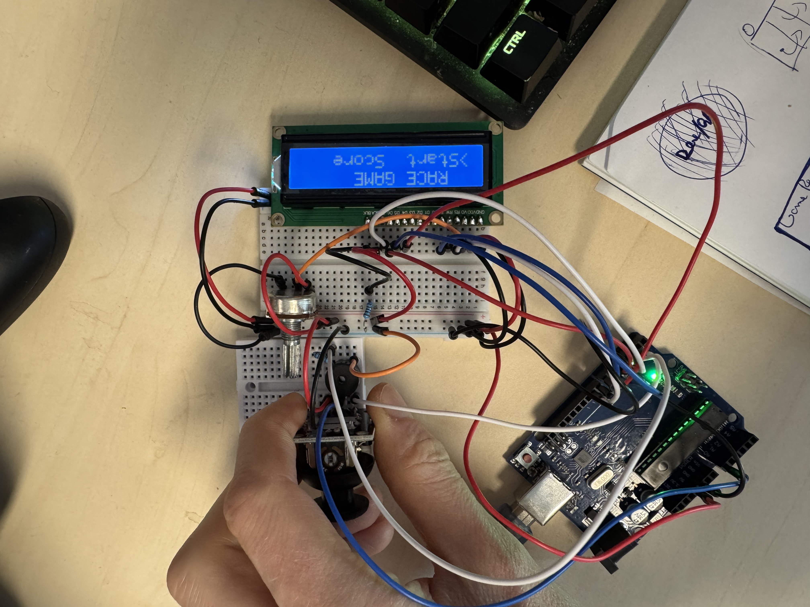

# Homeworks for FMI Course Intro-to-Robotics and related projects

## 3. Home Alarm System — Arduino UNO (Ultrasonic + LDR + LEDs + Buzzer)

### Demo & Code
- 🎥 Video: 
- 💻 Source code: [GitHub repo (Homework3)](https://github.com/AGAPIA/Intro-to-Robotics/tree/main/Homework3)

---

## 4. Simon Says — Arduino UNO + 74HC595 + Joystick + 4×7-Seg (CC)

### Demo & Code
- 🎥 Video: 
- 💻 Source code: [GitHub repo (Homework4)](https://github.com/AGAPIA/Intro-to-Robotics/tree/main/Homework4)

## 5. Arduino 16x2 LCD Racing Game 🤖

### Demo & Code

- 🎥 Video: \

- 💻 Source code: \[GitHub repo (Homework5)](https://github.com/AGAPIA/Intro-to-Robotics/tree/main/Homework5)
